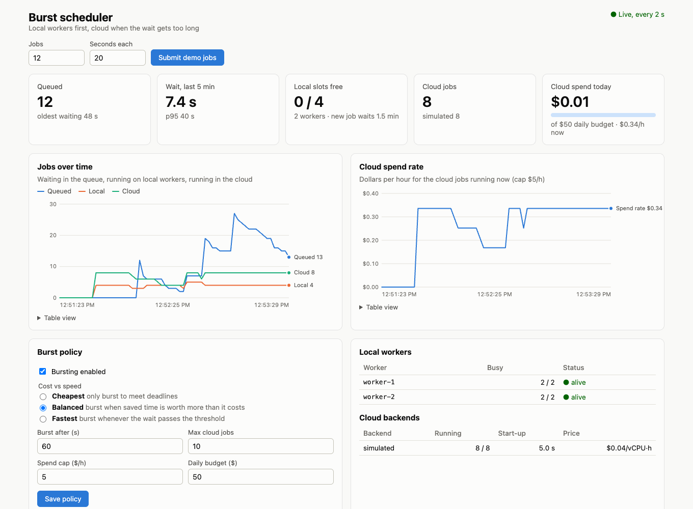
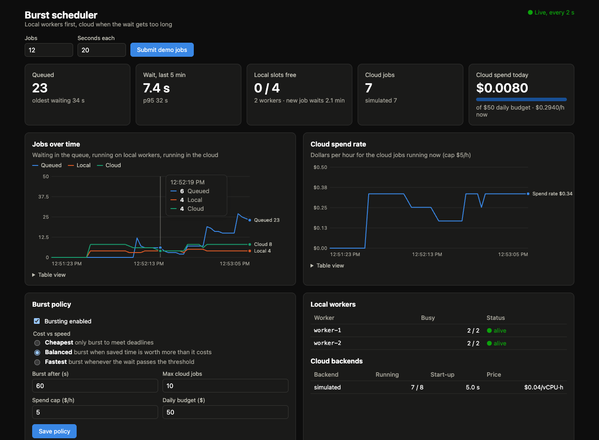

# burst-scheduler

[](https://github.com/Rishavbhattarai/burst-scheduler/actions/workflows/ci.yml)

burst-scheduler is a small job queue. It runs jobs on local machines, and when a job would wait too
long, it sends the job to cloud workers on Kubernetes or AWS Batch. Rules decide when the time saved is
worth the cloud cost, and a live dashboard shows where every job ran and why. The design follows
Princeton's Orchestrated Burst Compute and uses the HydroGEN stack: Docker, NATS, a REST API and a
React UI.



## Quick start

```bash
docker compose up --build            # NATS, controller + dashboard on http://localhost:8000, 2 workers
python3 scripts/load.py              # waves of jobs that spill over to the simulated cloud
```

## How it works

```
 dashboard (React) ─┐
             REST (FastAPI)                       NATS JetStream
 client ───▶ controller ──── burst.dispatch.local ────▶ worker 1  (runs jobs as subprocesses)
             │  SQLite queue ◀─── burst.events.job ────  worker 2
             │  scheduler loop ◀── burst.workers.heartbeat (core NATS)
             │  policy engine  ──────────────────── burst.control.cancel ─▶ all workers
             │
             └── submit / poll / cancel ──▶ Kubernetes Jobs · AWS Batch · simulated cloud
```

The controller holds the queue in SQLite. Workers report their free slots in heartbeats, and the
scheduler sends a job to NATS only when a local slot is free. Until then nobody has the job, so the
scheduler can still send it to the cloud instead.

Dispatches and job events go through JetStream, so a controller restart loses nothing. A worker
acknowledges a job only when it finishes and sends in-progress pings while it runs. If the worker
crashes, JetStream redelivers the job to another worker. Each dispatch carries `Nats-Msg-Id = job id`,
so if the controller dies between publishing a job and recording it, JetStream drops the second copy.
The store ignores duplicate and late events, so a repeated message never moves a job backwards.

Jobs with a higher `priority` run first, then the oldest. Cancelling a queued job removes it from the
queue. Cancelling a running job kills its whole process group, or deletes it on its cloud backend.

## Bursting to the cloud

Each scheduling pass fills the free local slots first. For every job still waiting, the policy
(`burst/policy.py`) either picks a cloud backend or records why the job stays:

1. A job becomes a candidate when its expected total wait (time waited so far plus the predicted
   remaining local wait) reaches `burst_threshold_s`, or when it would miss its `deadline_s` locally.
   The scheduler predicts the remaining wait from the job's queue position, the number of local slots
   and the median recent run time.
2. A backend qualifies only if it has free capacity (`max_jobs`), adding the job keeps the cloud spend
   rate under `max_spend_per_hour`, and the job's estimated cost fits in what is left of `daily_budget`.
   At most `max_cloud_jobs` run in the cloud at once.
3. If the job would miss its deadline locally, the cheapest backend that meets the deadline wins.
4. Otherwise each hour of waiting saved is worth `value_per_hour` dollars, doubled for every +10
   priority, and the backend with the largest positive net benefit (value of the time saved minus the
   cost) wins. The `cheapest` mode never bursts for speed alone, `balanced` values waiting at $2/h, and
   `fastest` bursts whenever the threshold is reached.

The scheduler writes its reason into each job's `decision` field, for example
`expected wait 20s ≥ 15s: saves 20s for $0.0012 on kubernetes` or `cloud job limit reached (2)`.
The controller estimates the cost at dispatch and charges the actual time from submission to finish.

| backend | how | notes |
|---|---|---|
| `kubernetes` | one `batch/v1` Job per burst job: CPU/memory requests and limits, `activeDeadlineSeconds` = timeout, no retries, TTL cleanup | reads the exit code and log tail back from the pod |
| `aws_batch` | `submit_job` with command/vCPU/memory overrides, `describe_jobs`, `terminate_job` | the job queue and job definition must exist; the image comes from the job definition |
| `simulated` | runs the job on the controller's machine after `startup_s` and bills it | for demos without a cloud account; jobs show the backend name, so simulated runs are always labelled |

Configure the policy and backends in a TOML file (`BURST_CONFIG=burst.toml`, see
[burst.example.toml](burst.example.toml)). You can also read and change the policy at runtime with
`GET`/`PUT /policy`.

To try Kubernetes locally with [kind](https://kind.sigs.k8s.io/):

```bash
kind create cluster --name burst
cp burst.example.toml burst.toml     # set enabled = true under [backends.kubernetes]
BURST_CONFIG=burst.toml .venv/bin/burst-controller
```

## Dashboard

`dashboard/` is a React + TypeScript app built with Vite. The controller serves the built app at `/`,
so `docker compose up` puts the API and the dashboard on port 8000. The dashboard shows:

- queued jobs and the oldest wait, p50 and p95 wait over the last 5 minutes, free local slots with
  the estimated wait for a new job, cloud jobs per backend, and today's spend against the daily budget
- charts of jobs queued, running locally and running in the cloud, and of the cloud spend rate, from
  `GET /stats/history` (sampled every 2 s, 30 minutes kept); hover, or focus a chart and use the arrow
  keys, to read every series at one moment, or open the table view under each chart
- policy controls for the mode, threshold, cloud job limit, spend cap and daily budget, which apply on
  the next scheduling pass
- workers, backends and recent jobs, with where each job ran, what it cost and the scheduler's reason

Light and dark mode follow the system setting. For development:

```bash
cd dashboard && npm install && npm run dev   # http://localhost:5173, proxies the API to :8000
```



## Run it

With Docker:

```bash
docker compose up --build              # NATS, controller on :8000, 2 workers with 2 slots each
docker compose up --scale worker=4     # more local capacity
```

The compose file loads `burst.example.toml`, so jobs that would wait more than 60 s locally go to the
simulated cloud. Point `BURST_CONFIG` at your own file to use Kubernetes or AWS Batch.

Without Docker you need `nats-server` (for example `brew install nats-server`):

```bash
python -m venv .venv && .venv/bin/pip install -e ".[dev]"
nats-server -js &
.venv/bin/burst-controller &
.venv/bin/burst-worker --slots 2 &
```

Generate load with `scripts/load.py`, which uses only the standard library (`--help` lists the options):

```bash
python3 scripts/load.py --waves 6 --jobs 20 --min-s 10 --max-s 40
```

Submit and inspect jobs by hand:

```bash
curl -X POST localhost:8000/jobs -H 'content-type: application/json' \
     -d '{"name": "hello", "command": ["python", "-c", "print(6 * 7)"], "priority": 5}'
curl localhost:8000/jobs/<id>          # state, worker, exit code, last 4 KB of output
curl localhost:8000/stats              # queue depth, oldest wait, p50/p95 wait, free slots, estimated wait
curl localhost:8000/workers
curl -X POST localhost:8000/jobs/<id>/cancel
```

Interactive API docs are at <http://localhost:8000/docs>.

## API

| method | path | |
|---|---|---|
| POST | `/jobs` | submit: `command` (argv list), `name`, `priority`, `timeout_s`, `est_runtime_s`, `deadline_s`, `image`, `cpu`, `memory_mb` |
| GET | `/jobs?state=&limit=` | list jobs, newest first |
| GET | `/jobs/{id}` | one job |
| POST | `/jobs/{id}/cancel` | cancel (409 if already finished) |
| GET | `/workers` | local workers and their free slots |
| GET | `/stats` | queue and wait-time statistics, cloud jobs, spend rate and today's spend |
| GET | `/stats/history?since=` | samples every 2 s for the last 30 minutes (for the charts) |
| GET / PUT | `/policy` | read or change the burst policy (partial updates) |
| GET | `/backends` | configured cloud backends, their prices and active jobs |
| GET | `/healthz` | controller health (no auth) |

Set `BURST_API_TOKEN` to require `Authorization: Bearer <token>`. Jobs run arbitrary commands on the
workers, so expose the API only on a trusted network.

## Configuration

| variable | default | |
|---|---|---|
| `BURST_NATS_URL` | `nats://127.0.0.1:4222` | controller and workers |
| `BURST_DB_PATH` | `burst.db` | controller's SQLite file |
| `BURST_API_TOKEN` | (none) | require a bearer token |
| `BURST_SCHEDULE_INTERVAL` | `0.5` | seconds between scheduling passes |
| `BURST_WORKER_TIMEOUT` | `10` | seconds without a heartbeat before a worker counts as gone |
| `BURST_WORKER_SLOTS` | CPU count | jobs a worker runs at once |
| `BURST_ACK_WAIT` | `30` | seconds before JetStream redelivers an unacknowledged job |
| `BURST_CONFIG` | (none) | TOML file with `[policy]` and `[backends.*]`; without it every job runs locally |
| `BURST_CLOUD_POLL_INTERVAL` | `2` | seconds between cloud status checks |
| `BURST_DASHBOARD_DIR` | `dashboard/dist` | built dashboard served at `/` (skipped if missing) |

## Tests

```bash
.venv/bin/pytest                                        # 71 tests, about 40 s
BURST_K8S_CONTEXT=kind-burst .venv/bin/pytest -m k8s    # against a real cluster
```

- Unit tests cover the store, the scheduler, every policy rule, the Kubernetes manifest and status
  mapping, and the AWS Batch calls, which botocore's `Stubber` checks against the real API schema.
- End-to-end tests start a real `nats-server` (they skip if it is not installed). They check job
  outcomes, priority order, cancellation, redelivery after `kill -9` of a worker, events surviving a
  controller restart, and bursting: the threshold, the job limit, deadlines, cheapest mode, cloud
  cancellation, a failing backend and policy changes at runtime.
- `-m k8s` runs jobs on a real kind cluster: success, exit codes, deadlines, cancellation, and the
  controller bursting into Kubernetes.

GitHub Actions runs five jobs on every push: lint and tests on Python 3.11 and on 3.13, both with a real
nats-server; the Kubernetes tests on a kind cluster; the dashboard type check and build; and a
`docker compose` smoke test (`scripts/smoke.sh`) that sends a wave of jobs and checks that they finish
on both the local workers and the simulated cloud.

## Layout

```
burst/            controller (API + scheduler), worker, store, policy, NATS setup
burst/backends/   kubernetes, aws_batch, simulated
dashboard/        React + TypeScript dashboard (Vite)
scripts/          load generator, CI smoke test, nats-server installer
tests/            unit, end-to-end (real NATS) and Kubernetes tests
```
